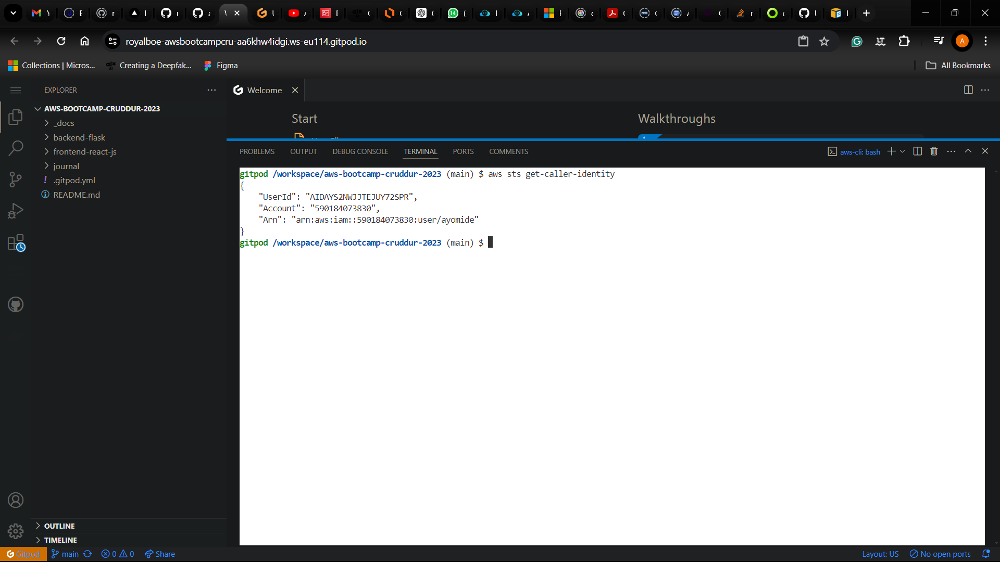

# Week 0 — Billing and Architecture

## Required Homework/Tasks

### Install and Verify AWS CLI 

I installed and verified AWS CLI on gitpod and on my local machine

For my local machine which is windows, I installed aws cli using **powershell**:
I ran the following commands
In order to prove that I am able to use the AWS CLI.
I am providing the instructions I used for my configuration of my local machine on windows.

I did the following steps to install AWS CLI.

I installed the AWS CLI for Windows 10 via command in **Command Prompt**:

I followed the instructions on the [AWS CLI Install Documentation Page](https://docs.aws.amazon.com/cli/latest/userguide/getting-started-install.html)

```PowerShell
msiexec.exe /i https://awscli.amazonaws.com/AWSCLIV2.msi /qn
aws --version
```

I got this as a reponse

```powershell
C:\Users\Windows>aws --version
'aws' is not recognized as an internal or external command,
operable program or batch file.
```

I had to restart the terminal to see the version of aws after running `aws --version`


### Install AWS CLI on gitpod manually

```bash
curl "https://awscli.amazonaws.com/awscli-exe-linux-x86_64.zip" -o "awscliv2.zip"
unzip awscliv2.zip
sudo ./aws/install
```
### Install AWS CLI On Gitpod auomatically at set up

- We are going to install the AWS CLI when our Gitpod enviroment lanuches.
- We are are going to set AWS CLI to use partial autoprompt mode to make it easier to debug CLI commands.
- The bash commands we are using are the same as the [AWS CLI Install Instructions]https://docs.aws.amazon.com/cli/latest/userguide/getting-started-install.html


Update `.gitpod.yml` to include the following task.

```sh
tasks:
  - name: aws-cli
    env:
      AWS_CLI_AUTO_PROMPT: on-partial
    init: |
      cd /workspace
      curl "https://awscli.amazonaws.com/awscli-exe-linux-x86_64.zip" -o "awscliv2.zip"
      unzip awscliv2.zip
      sudo ./aws/install
      cd $THEIA_WORKSPACE_ROOT
```

### Create a new User and Generate AWS Credentials

- I created a new user ayomide using (IAM Users Console](https://us-east-1.console.aws.amazon.com/iamv2/home?region=us-east-1#/users)
- I `enabled console access` for the user
- I created a new `Admin` Group and applied `AdministratorAccess`
- I added the user ayomide to the admin group
- I created `Security Credentials` for the new user

### Set Env Vars

I used the following command to attach my credentials to the current bash terminal

```bash
export AWS_ACCESS_KEY_ID=""
export AWS_SECRET_ACCESS_KEY=""
export AWS_DEFAULT_REGION=us-east-1
```

Then I persisted it on Gitpod to remember these credentials if we relaunch our workspaces

```bash
gp env AWS_ACCESS_KEY_ID=""
gp env AWS_SECRET_ACCESS_KEY=""
gp env AWS_DEFAULT_REGION=us-east-1
```

### Check that the AWS CLI is working and you are the expected user

```bash
aws sts get-caller-identity
```

I got this:

```json
{
    "UserId": "AIDAYS2NWJJTEJUY72SPR",
    "Account": "590184073830",
    "Arn": "arn:aws:iam::590184073830:user/ayomide"
}
```


I also persisted the account id on gitpod

```bash
export AWS_ACCOUNT_ID=$(aws sts get-caller-identity --query Account --output text)
gp env AWS_ACCOUNT_ID=$(aws sts get-caller-identity --query Account --output text)
```

### Create a Budget using AWS Console

I created my own Budget for zero net spend budget using the console and I had three alerts on it
- For over 0.01 dollars for actual cost
- For over 50% of 1 dollar for actual cost
- For over 80% of 1 dollar for forecasted cost


### Create a Budget using AWS CLI

I created another Budget budget using the cli and I had three alerts on it
- For over 1 dollars for actual cost
- For over 50% of 5 dollar for actual cost
- For over 80% of 5 dollar for forecasted cost


```bash
aws budgets create-budget \
    --account-id $AWS_ACCOUNT_ID \
    --budget file://aws/json/budget.json \
    --notifications-with-subscribers file://aws/json/notifications-with-subscribers.json
```



### MFA for root account

I set up MFA for my root account


### Recreate Logical Architectural Deisgn


[Lucid Charts Share Link](https://lucid.app/lucidchart/43ec5cae-507c-4dde-a664-910864df9671/edit?viewport_loc=-1747%2C-193%2C2882%2C1360%2C0_0&invitationId=inv_6f8ebbb3-39da-457f-893f-91f720c183ea
)
