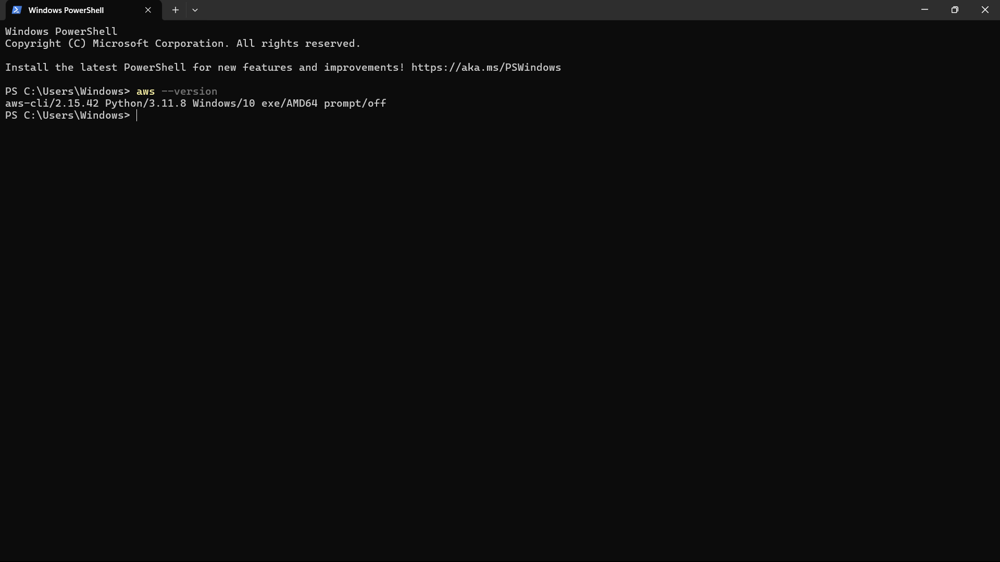
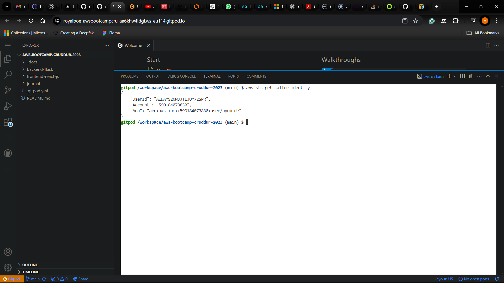
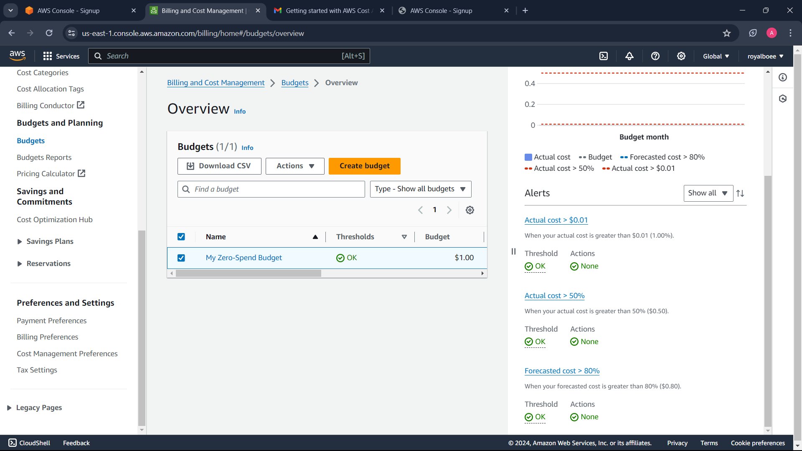
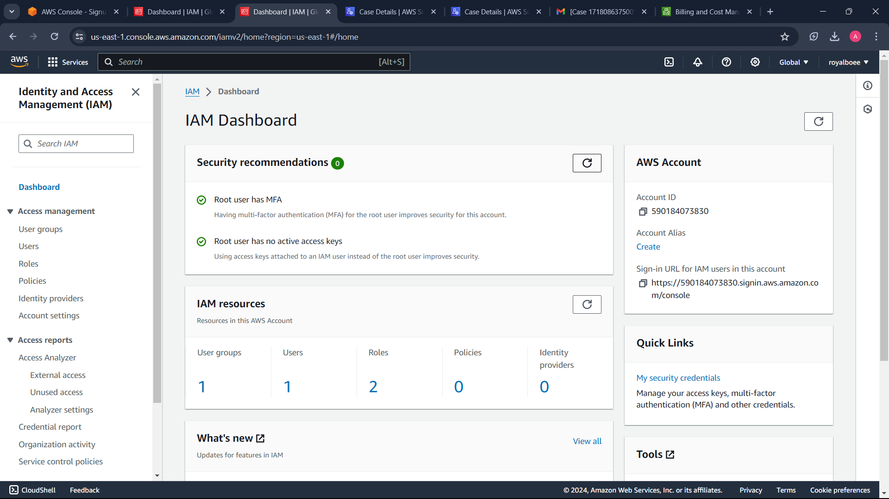
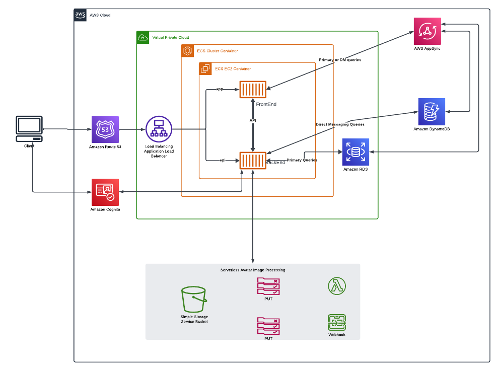

# Week 0 — Billing and Architecture

## Required Homework/Tasks

### Install and Verify AWS CLI 

I installed and verified AWS CLI on gitpod and on my local machine

For my local machine which is windows, I installed aws cli using **powershell**:
I ran the following commands
In order to prove that I am able to use the AWS CLI.
I am providing the instructions I used for my configuration of my local machine on windows.

I did the following steps to install AWS CLI.

I installed the AWS CLI for Windows 10 via command in **Command Prompt**:

I followed the instructions on the [AWS CLI Install Documentation Page](https://docs.aws.amazon.com/cli/latest/userguide/getting-started-install.html)

```PowerShell
msiexec.exe /i https://awscli.amazonaws.com/AWSCLIV2.msi /qn
aws --version
```

I got this as a reponse

```powershell
C:\Users\Windows>aws --version
'aws' is not recognized as an internal or external command,
operable program or batch file.
```

I had to restart the terminal to see the version of aws after running `aws --version`




### Create a Budget using AWS Console

I created my own Budget for zero net spend budget using the console and I had three alerts on it
- For over 0.01 dollars for actual cost
- For over 50% of 1 dollar for actual cost
- For over 80% of 1 dollar for forecasted cost



### Create a Budget using AWS CLI

I created another Budget budget using the cli and I had three alerts on it
- For over 1 dollars for actual cost
- For over 50% of 5 dollar for actual cost
- For over 80% of 5 dollar for forecasted cost

```bash
aws budgets create-budget \
    --account-id 111122223333 \
    --budget file://budget.json \
    --notifications-with-subscribers file://notifications-with-subscribers.json
```


### MFA for root account

I set up MFA for my root account



### Recreate Logical Architectural Deisgn



[Lucid Charts Share Link](https://lucid.app/lucidchart/43ec5cae-507c-4dde-a664-910864df9671/edit?viewport_loc=-1747%2C-193%2C2882%2C1360%2C0_0&invitationId=inv_6f8ebbb3-39da-457f-893f-91f720c183ea
)

## Example of Referencing a file in the codebase

Example of me of referencing a file in my repo
[week-1-again/aws/json/alarm-config.jso](https://github.com/omenking/aws-bootcamp-cruddur-2023/blob/week-1-again/aws/json/alarm-config.json)

## List Example

- This
- Is 
- A
- List

1. This
2. Is
3. A 
3. Ordered 
4. List

## Table Example

| My | Cool | Table |
| --- | --- | ---|
| Hello | World | ! |

## Code Example

```json
{
  "AlarmName": "DailyEstimatedCharges",
  "AlarmDescription": "This alarm would be triggered if the daily estimated charges exceeds 1$",
  "ActionsEnabled": true,
  "AlarmActions": [
      "arn:aws:sns:ca-central-1:***REMOVED***:billing-alarm"
  ],
  "EvaluationPeriods": 1,
  "DatapointsToAlarm": 1,
  "Threshold": 1,
  "ComparisonOperator": "GreaterThanOrEqualToThreshold",
  "TreatMissingData": "breaching",
  "Metrics": [{
      "Id": "m1",
      "MetricStat": {
          "Metric": {
              "Namespace": "AWS/Billing",
              "MetricName": "EstimatedCharges",
              "Dimensions": [{
                  "Name": "Currency",
                  "Value": "USD"
              }]
          },
          "Period": 86400,
          "Stat": "Maximum"
      },
      "ReturnData": false
  },
  {
      "Id": "e1",
      "Expression": "IF(RATE(m1)>0,RATE(m1)*86400,0)",
      "Label": "DailyEstimatedCharges",
      "ReturnData": true
  }]
}
```

## Install AWS CLI

```bash
curl "https://awscli.amazonaws.com/awscli-exe-linux-x86_64.zip" -o "awscliv2.zip"
unzip awscliv2.zip
sudo ./aws/install
```